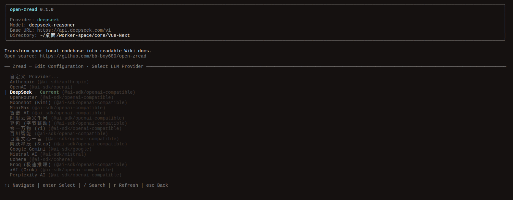

<h1 align="center">Open Zread</h1>

<p align="center">
  
  
  
  
  
</p>

<p align="center">
  <strong>一行命令，把整个项目变成 Wiki。</strong><br>
  AI 帮你写文档，你只管写代码。
</p>

<p align="center">
  <a href="https://github.com/bb-boy680/open-zread">GitHub</a> ·
  <a href="https://www.npmjs.com/package/@open-zread/cli">npm</a> ·
  <a href="https://github.com/bb-boy680/open-zread/issues">Issues</a>
</p>

---

## Showcase

> Open Zread 是 [zread](https://zread.ai/cli) 的开源复刻版，把代码变成结构化 Wiki 文档，目录按功能模块自动聚合。

- **接手新项目** → 几万行零文档代码，跑一遍直接拿到模块划分清晰的 Wiki
- **写文档** → 不用边写代码边写注释，AI 自动提取接口、依赖、调用关系
- **团队交接** → 新人看 Wiki 就知道核心模块在哪、谁调了谁
- **代码重构** → 改完重新跑一遍，旧 Wiki 一键刷新
- **多语言项目** → Go / Rust / Python / Java / C++，web-tree-sitter 全支持

---

## Screenshot

<p align="center">
  
  <br>
  <br>
  
</p>

---

## 如何使用

**1. 安装**

```bash
npm i -g @open-zread/cli
```

**2. 使用**

```bash
open-zread
```

进入终端 UI 后，选择 LLM 提供商，点 `Generate Documentation`，等 AI 分析完成，`wiki.json` 到手。

---

## 为什么选 Open Zread？

市面上不是没有类似工具，但它们都有致命缺陷：

| 方案 | 问题 | Open Zread |
|------|------|------------|
| **手动写文档** | 耗时、过时、没人看 | AI 自动生成，改代码重新跑一遍就行 |
| **GitHub Copilot / Cursor** | 只能读当前文件，不了解全局 | 三层 Repo Map 建立全局理解 |
| **Mintlify / Mintlify Writer** | 只支持前端，后端无能为力 | 全语言覆盖，Go/Rust/Python/Java 都行 |
| **Documatic** | 闭源 SaaS，每月 $99 | 开源免费，本地运行，数据不外传 |
| **GitHub Wiki** | 纯手动编辑，跟代码完全脱节 | 自动从代码生成，目录按功能模块聚合 |
| **Scribe** | 录屏操作，不是代码分析 | 真正读 AST，理解代码语义 |
| **其他 AI 文档工具** | 只读 README，不看源码 | web-tree-sitter 解析完整符号表 |

**核心差异：**

- **本地运行** — 代码不上传，API Key 自己填，数据不出你的机器
- **终端操作** — 不用开浏览器，不用注册账号，不用点网页
- **按需深入** — 不是把代码全塞给 AI，而是像开发者一样逐层理解
- **增量更新** — 文件没改就不重新分析，省时省 token

---

## 工作原理

```
项目代码
   │
   ├── 扫描 ──────── glob + .gitignore，找出所有源码文件
   │
   ├── 解析 ──────── web-tree-sitter 解析 AST，提取符号表
   │
   ├── 缓存 ──────── 符号级哈希，文件没改就不重新解析
   │
   ├── Agent ───── 三层 Repo Map 渐进分析：
   │   │
   │   ├── 第一层  目录树 → 建立全局框架
   │   ├── 第二层  核心签名 → 提取高频引用 API
   │   └── 第三层  模块详情 → 按需深入
   │
   └── 输出 ──────── wiki.json，结构化 Wiki 蓝图
```

## Roadmap

| 功能 | 状态 | 说明 |
|------|------|------|
| 终端 UI | ✅ | Ink + React 交互式终端界面 |
| 20+ LLM 提供商 | ✅ | Anthropic / OpenAI / DeepSeek / Gemini 等 |
| 三层 Repo Map | ✅ | 目录树 → 核心签名 → 模块详情 |
| 符号级增量缓存 | ✅ | 基于文件 Hash，未变更文件跳过 |
| 多语言解析 | ✅ | web-tree-sitter 支持 Go/Rust/Python/Java/C++ |
| 终端配置管理 | ✅ | 终端 UI 直接修改配置，无需碰文件 |
| Browse 服务 | ☐ | 启动本地预览服务器，在浏览器中查看 Wiki |
| 增量文档更新 | ☐ | 基于文件 Hash 比对，只更新变更部分 |
| 自定义 Rules & Skill | ☐ | 按自己的风格定义文档生成规则 |

---

## License

MIT
