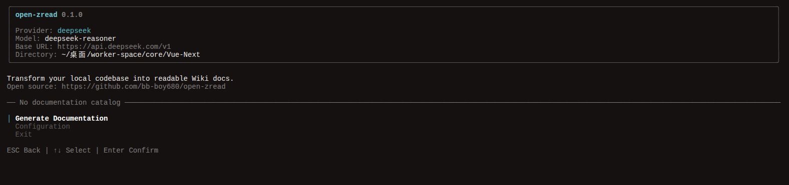
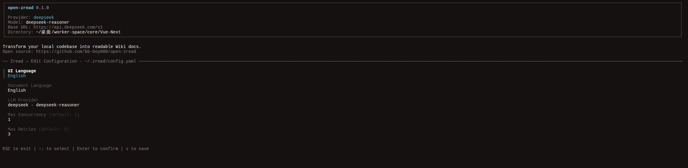
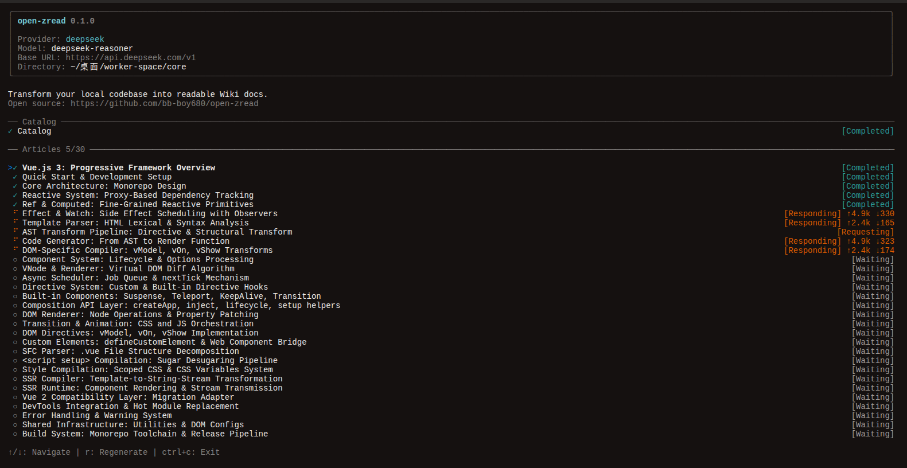

<h1 align="center">Open Zread</h1>

<p align="center">
  
  
  
  
  
</p>

<p align="center">
  <strong>一行命令，把整个项目变成高质量的 Wiki 文档库。</strong><br>
  AI 帮你读代码、理逻辑、写文档，你只管写代码。
</p>

<p align="center">
  <a href="https://github.com/bb-boy680/open-zread">GitHub</a> ·
  <a href="https://www.npmjs.com/package/@open-zread/cli">npm</a> ·
  <a href="https://github.com/bb-boy680/open-zread/issues">Issues</a>
</p>

---

## 💡 Showcase

Open Zread 是[zread.ai](https://zread.ai/) 的开源复刻版与精神延续。它不仅是一个文档生成器，更是一个**开源代码库领航员**。

- 🚀 **接手新项目** → 面对几万行“祖传零文档”代码，跑一遍直接拿到模块划分清晰、带有架构图的 Wiki。
- ✍️ **解放开发者** → 不用边写代码边补注释，AI 自动为你提取接口、依赖、最佳实践调用用例。
- 🤝 **团队无缝交接** → 新人看 Wiki 就能瞬间建立全局认知，知道核心模块在哪、谁调了谁。
- 🔄 **代码重构伴侣** → 改完代码重新跑一遍，借助增量缓存，旧 Wiki 极速刷新。
- 🌍 **全语言制霸** → 基于 `web-tree-sitter`，完美支持 TS/JS / Go / Rust / Python / Java / C++。

---

## 📸 运行掠影 (Screenshots)

<p align="center">
  
  
</p>
<p align="center">
  
</p>

---

## 🚀 快速开始

**环境要求**: Node.js >= 18

**1. 全局安装**

```bash
npm i -g @open-zread/cli
```

**2. 在你的任意项目根目录下运行**

```bash
open-zread
```

🎉 **就这么简单！**
进入极客风的终端 UI 后：
1. 填入你的大模型 API Key（支持 75+ 家 Provider，如 OpenAI, Anthropic, DeepSeek 等）。
2. 点击 `Generate Documentation`。
3. 稍等片刻，你的项目目录下会自动生成一个排版精美、带 Mermaid 架构图的 `Wiki/` Markdown 文件夹！

---

## 🥊 为什么选 Open Zread？

市面上文档工具千千万，但它们多多少少有致命缺陷，而 Open Zread 为此而生：

| 方案 | 痛点 | 🌟 Open Zread 的解法 |
|------|------|------------|
| **手动写文档** | 耗时、过时、根本没人愿意写 | AI 自动扫描生成，改完代码跑一遍同步更新 |
| **Copilot / Cursor** | 只能根据当前文件聊天，缺乏全局视角 | 独创 **三层 Repo Map**，建立上帝视角的全局理解 |
| **Mintlify / JSDoc** | 只支持前端生态，后端无能为力 | AST 级解析，Go/Rust/Python/Java 全量支持 |
| **闭源 AI 文档 SaaS**| 每月高昂订阅费，且存在代码泄露风险 | **完全开源免费**，本地运行，数据不出你的机器 |
| **传统 RAG 生成** | 只是简单总结 README，干瘪空洞 | 并行 Agent 根据真实代码形态**自适应生成** API 与架构图 |

---

## ⚙️ 核心工作原理

我们没有把代码粗暴地一股脑塞给大模型，而是模拟了顶级架构师阅读源码的认知流：

```text
你的代码库
   │
   ├── 1. 扫描 ────── glob + .gitignore，精确定位所有源码文件
   │
   ├── 2. 解析 ────── web-tree-sitter 解析 AST，提取导出与签名
   │
   ├── 3. 缓存 ────── 符号级哈希校验，没改动的文件直接跳过，省钱省时
   │
   ├── 4. 蓝图 ────── Agent 构建三层 Repo Map 渐进分析：
   │   │                ├─ 层一：目录拓扑 → 建立宏观架构
   │   │                ├─ 层二：核心签名 → 寻找高频引用接口
   │   │                └─ 层三：按需深挖 → 划分业务边界，生成 wiki.json
   │
   └── 5. 创作 ────── N 个并发 Page Agent，针对每个模块阅读真实代码，
                      自适应绘制 Mermaid 图表，产出顶级 Markdown 文档！
```

---

## 🗺️ Roadmap (路线图)

| 功能特性 | 状态 | 说明 |
|------|------|------|
| 🎨 **终端 UI 引擎** | ✅ | 基于 Ink + React 的极致交互式终端界面 |
| 🤖 **多 LLM 无缝切换** | ✅ | 底层集成 Vercel AI SDK，支持 75+ 模型 (DeepSeek/Claude 等) |
| 🧠 **三层 Repo Map** | ✅ | 目录树 → 核心签名 → 模块详情，永不 Token 溢出 |
| ⚡ **符号级增量缓存** | ✅ | 基于 AST 文件 Hash，未变更文件秒跳过 |
| 🌍 **多语言全栖解析** | ✅ | 预置主流语言 Tree-sitter 引擎支持 |
| 📝 **并发 Wiki 创作引擎**| ✅ | TypeScript 调度 N 个独立 Agent 生成高质量 Markdown |
| ⚙️ **无文件配置管理** | ✅ | 终端 UI 内部直接增删改查 Provider 和 Key |
| 🌐 **本地 Web 预览服务** | ☐ | `open-zread browse` 启动本地服务器，浏览器沉浸式阅读 Wiki |
| 🔄 **细粒度增量更新** | ☐ | 仅重写发生代码变更关联的 Markdown 页面 |
| 🛠️ **自定义 Rules & Skill**| ☐ | 允许团队传入自定义的 Rules 和 Skill，深度定制专属的文档生成风格 |

---

## 🤝 参与贡献 (Contributing)

Open Zread 正在快速迭代中！如果你有任何想法、发现了 Bug，或者想支持新的语言解析，非常欢迎提交 Issue 或 Pull Request。

如果这个工具帮到了你，请给一个 ⭐️ **Star**，这是对开源作者最大的鼓励！

## 📄 License

[MIT License](./LICENSE) © 2026 Open Zread
