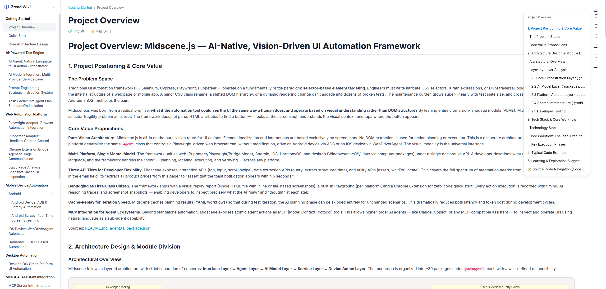

<p align="center">
  <a href="README.md">English</a> · <a href="docs/README.zh-CN.md">简体中文</a>
</p>

<h1 align="center">Open Zread</h1>

<p align="center">
  
  
  
  
  
</p>

<p align="center">
  <strong>Turn your entire project into a high-quality Wiki documentation library with a single command.</strong><br>
  AI reads your code, understands the logic, writes the docs — you just focus on coding.
</p>

<p align="center">
  <a href="https://github.com/bb-boy680/open-zread">GitHub</a> ·
  <a href="https://www.npmjs.com/package/@open-zread/cli">npm</a> ·
  <a href="https://github.com/bb-boy680/open-zread/issues">Issues</a>
</p>

---

## 💡 Showcase

Open Zread is an open-source recreation and spiritual successor to [zread.ai](https://zread.ai/). It's not just a documentation generator — it's an **open-source codebase navigator**.

- 🚀 **Onboarding New Projects** → Face tens of thousands of lines of "legacy code with zero docs"? Run once and get a Wiki with clear module boundaries and architecture diagrams.
- ✍️ **Liberate Developers** → No need to write comments while coding. AI automatically extracts interfaces, dependencies, and best-practice usage examples.
- 🤝 **Seamless Team Handoffs** → New team members can instantly grasp the big picture from the Wiki — knowing where core modules are and who calls what.
- 🔄 **Refactoring Companion** → Re-run after code changes. With incremental caching, your old Wiki gets refreshed at lightning speed.
- 🌍 **Multi-Language Support** → Built on `web-tree-sitter`, with full support for TS/JS, Go, Rust, Python, Java, and C++.

---

## 📸 Screenshots

<p align="center">
  
  
</p>
<p align="center">
  
</p>
<p align="center">
  
</p>

---

## 🚀 Quick Start

**Requirements**: Node.js >= 18

**1. Install globally**

```bash
npm i -g @open-zread/cli
```

**2. Run in any project root directory**

```bash
open-zread
```

🎉 **That's it!**
Once inside the geeky terminal UI:
1. Enter your LLM API Key (supports 75+ providers like OpenAI, Anthropic, DeepSeek, etc.).
2. Click `Generate Documentation`.
3. Wait a moment, and a beautifully formatted `Wiki/` Markdown folder with Mermaid architecture diagrams will be generated in your project directory!

**Preview Wiki in Browser**:

```bash
open-zread browse
```

Automatically starts a local web server for immersive Wiki reading in your browser — sidebar navigation, Mermaid diagram rendering, and code highlighting, all in one place.

---

## 🥊 Why Open Zread?

There are countless documentation tools out there, but they all have fatal flaws. Open Zread was born to solve them:

| Approach | Pain Point | 🌟 Open Zread's Solution |
|------|------|------------|
| **Manual Documentation** | Time-consuming, quickly outdated, nobody wants to write it | AI automatically scans and generates; re-run after code changes to sync updates |
| **Copilot / Cursor** | Only chats based on current file, lacks global perspective | Unique **Three-Layer Repo Map** builds a god's-eye view of global understanding |
| **Mintlify / JSDoc** | Only supports frontend ecosystem, backend is out of luck | AST-level parsing with full support for Go/Rust/Python/Java |
| **Closed-source AI Doc SaaS**| Expensive monthly subscriptions and code leakage risks | **Fully open-source and free**, runs locally, your data never leaves your machine |
| **Traditional RAG Generation**| Just summarizes README, resulting in dry and hollow content | Parallel Agents **adaptively generate** APIs and architecture diagrams based on actual code patterns |

---

## ⚙️ How It Works

We don't just dump code into an LLM. Instead, we simulate how a top-tier architect reads source code:

```text
Your Codebase
   │
   ├── 1. Scan ────── glob + .gitignore to precisely locate all source files
   │
   ├── 2. Parse ────── web-tree-sitter parses AST, extracts exports and signatures
   │
   ├── 3. Cache ────── Symbol-level hash verification, skip unchanged files to save time and money
   │
   ├── 4. Blueprint ─ Agent builds three-layer Repo Map with progressive analysis:
   │   │                ├─ Layer 1: Directory Topology → Establish macro architecture
   │   │                ├─ Layer 2: Core Signatures → Find frequently referenced interfaces
   │   │                └─ Layer 3: Deep Dive → Define business boundaries, generate wiki.json
   │
   └── 5. Create ────── N parallel Page Agents read real code for each module,
                      adaptively render Mermaid diagrams, and produce top-tier Markdown docs!
```

---

## 🗺️ Roadmap

| Feature | Status | Description |
|------|------|------|
| 🎨 **Terminal UI Engine** | ✅ | Ultimate interactive terminal interface based on Ink + React |
| 🤖 **Multi-LLM Switching** | ✅ | Integrated Vercel AI SDK, supports 75+ models (DeepSeek, Claude, etc.) |
| 🧠 **Three-Layer Repo Map** | ✅ | Directory tree → Core signatures → Module details, never overflows tokens |
| ⚡ **Symbol-level Incremental Cache** | ✅ | Based on AST file hash, unchanged files are skipped instantly |
| 🌍 **Multi-language Parsing** | ✅ | Pre-built Tree-sitter engine support for major languages |
| 📝 **Parallel Wiki Generation Engine**| ✅ | TypeScript orchestrates N independent Agents to generate high-quality Markdown |
| ⚙️ **File-free Config Management** | ✅ | Add/remove/update providers and keys directly within terminal UI |
| 🌐 **Local Web Preview Server** | ✅ | `open-zread browse` starts local server for immersive Wiki reading in browser |
| 🔄 **Fine-grained Incremental Updates** | ☐ | Only rewrite Markdown pages associated with code changes |
| 🛠️ **Custom Rules & Skills**| ☐ | Allow teams to pass custom Rules and Skills for deep customization of documentation style |

---

## 🤝 Contributing

Open Zread is iterating rapidly! If you have any ideas, find bugs, or want to support new language parsing, Issues and Pull Requests are very welcome.

If this tool helped you, please give it a ⭐️ **Star** — that's the biggest encouragement for open-source authors!

## 📄 License

[MIT License](./LICENSE) © 2026 Open Zread